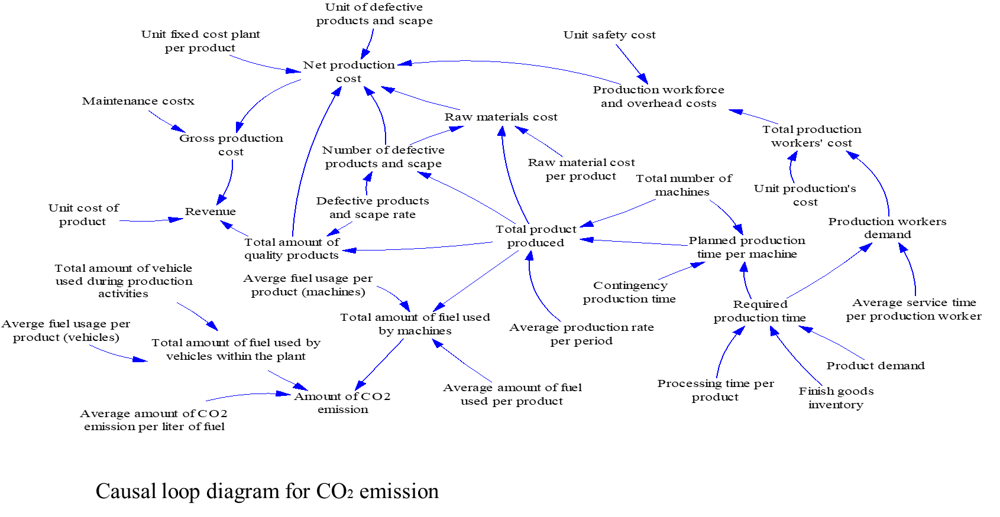
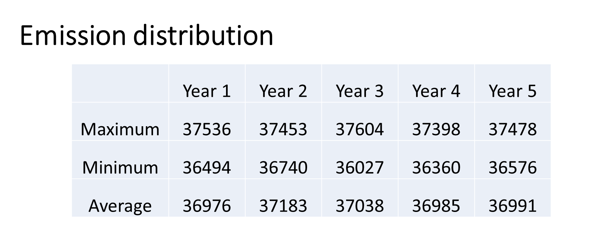
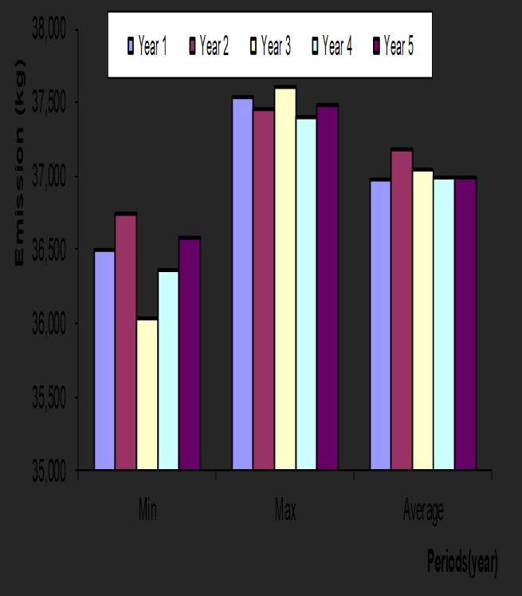
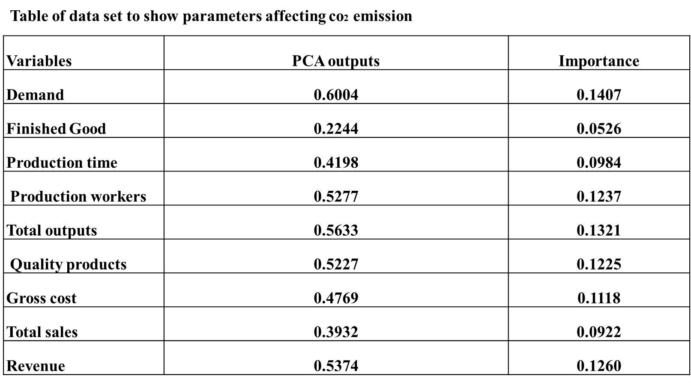

`# Ranking parameters that Affect C02 emission in Nigeria`

This project aims to evaluate CO2 emissions from a production system.
The specific objectives are :
- **To develop a system dynamics diagram for fossil fuel usage in a production plant.**
- **To rank the parameters that contribute to CO2 emission in production systems**
- **To verify the performance of the proposed model**

The sample dataset used in this project was sourced from [enkay plastics ltd]. it contains 1,825 rows and 12 columns, including features like finished goods, total output and quality products

The dataset had a few missing values in columns such as `production time` and `production workers`. These were handled by using median imputation and mode substitution, respectively.
The mean of each month was also found to simplify the bulk of data.

To replicate this project, you need to install the required packages. You can do this by running:

```bash
pip install -r requirements.txt

To run the project, execute the following command:


python main.py
```

- **Feature Engineering**: Created new features like `gross production cost ` by summing up the net production cost and maintenance cost.
- **Model Diagram**: Vensim software was used to construct the causal loop model for CO2 emission from a production system.



Used Principal Component Analysis (PCA) because it is very useful for searching for connections in high amounts of data and multiple dimensions.
In this case the specific property of interest was:
- **Dimensional Reduction**: A very efficient way of trying to take a good snap of it all from best view to cover the widest range.







This proposed study has successfully used system dynamics approach to rank parameters that contribute to CO2 emission in production systems. The most important parameter that affect CO2 emission is demand, while Finish goods inventory is the least parameter that affects CO2 emission.


- Relationships of other parameters, hence plotted against each other, to derive more optimal and accurate ways of increasing the details in regard to finding more solutions to current problems
- Experiment with deep learning models for better performance.
- Prospective organizational executives should reason about the adoption of a computerized version of the above study, so to be more effective in achieving sustainable environments.

Masaki I, Toru t, Keiji f, Tsuyoshi o (2018): Overview of CO2 Capture and Storage Technology; an introduction of MHI'S CO2 Recovery Process.
Q. Guo,( 2019) Progress In The Technology Of Capture And Utilization Of Greenhouse Gas Carbon Dioxide ,Chemical Industry Publishing House, Beijing, , Pp. 1-394.
Zhang X-P and Cheng X-M, (2017): "Energy consumption, carbon emissions, and economic growth in China", Ecological Economic, 68:2706–12.

Contributions are welcome! Please open an issue or submit a pull request.
